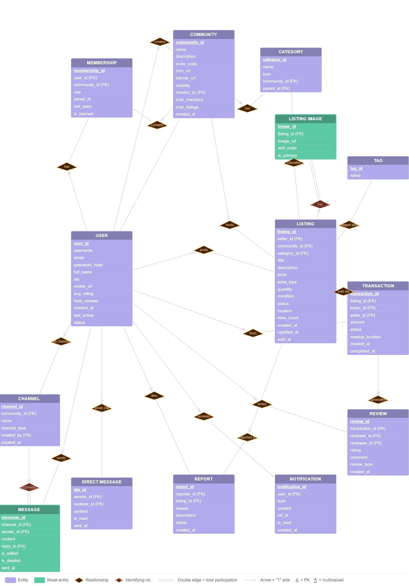

# MarketMesh 🛍️

A **multi-community marketplace platform** built as a DBMS course project. Users can join multiple communities (like apartment blocks, university groups, or hobby clubs) and buy/sell items, offer services, and interact within each community's own marketplace.

> Built with MySQL, Node.js, and vanilla HTML/CSS/JS.

---

## Preview

<!-- Add a screenshot of the login screen here -->


<!-- Add a screenshot of the main marketplace dashboard here -->


<!-- Add a screenshot of a listing detail panel here -->


---

## Features

- **User Auth** — Register, login, session management via `user_session` table
- **Communities** — Create and join multiple communities, each with its own marketplace
- **Listings** — Post items/services with categories, conditions, price types, and images
- **Roles** — Owner, Admin, Moderator, Member per community
- **Transactions** — Mark items as sold, full transaction tracking
- **Reviews & Ratings** — Buyer/seller reviews auto-update seller rating via triggers
- **Discussions** — Community channels and direct messaging
- **Reports & Notifications** — Flag listings, receive in-app notifications
- **SQL Console** — Live SQL query log visible in the frontend (demo/viva mode)

---

## Tech Stack

| Layer | Technology |
|---|---|
| Frontend | HTML, CSS, Vanilla JavaScript |
| Backend | Node.js, Express.js |
| Database | MySQL (InnoDB) |
| Auth | Session tokens via `user_session` table |

---

## Database Design

This project is heavily focused on database design as part of a DBMS course.

<!-- Add the ER diagram image here -->


### Schema Highlights

- **16 tables** normalized to 3NF
- **5 stored procedures** — `sp_login`, `sp_create_listing`, `sp_join_community`, `sp_mark_sold`, `sp_add_review`
- **9 triggers** — auto-update seller ratings, prevent duplicate memberships, sync member/listing counts, timestamp on status change
- **10+ complex queries** — window functions, multi-table joins, aggregations, GROUP_CONCAT
- **2 views** — `vw_active_listings`, `vw_community_stats`

---

## Project Structure

```
MARKETMESH/
│
├── .gitignore
├── README.md
│
├── database/
│   ├── marketplace_schema.sql
│   └── er_diagrams/
│       ├── ER_Model.png
│       └── ER_Model_copy.png
│
├── frontend/
│   └── marketplace_frontend.html
│
└── backend/
    ├── server.js
    ├── package.json
    └── package-lock.json
```

---

## Getting Started

### Prerequisites
- [Node.js](https://nodejs.org/) (v16 or above)
- [MySQL](https://www.mysql.com/) (v8 or above)

### Setup

**1. Clone the repository**
```bash
git clone https://github.com/your-username/marketmesh.git
cd marketmesh
```

**2. Install backend dependencies**
```bash
cd backend
npm install
```

**3. Set up the database**
```bash
mysql -u root -p < database/marketplace_schema.sql
```

**4. Configure environment variables**

Create a `.env` file inside the `backend/` folder:
```
DB_HOST=localhost
DB_USER=root
DB_PASSWORD=your_mysql_password
DB_NAME=marketplace_db
PORT=3000
```

**5. Start the backend server**
```bash
node server.js
```

**6. Open the frontend**

Open `frontend/marketplace_frontend.html` directly in your browser.

---

## Demo Accounts

The schema includes sample data with these pre-loaded accounts:

| Username | Password | Role |
|---|---|---|
| alice_k | pass123 | Seller — Furniture & Books |
| bob_s | pass123 | Seller — Books |
| carol_n | pass123 | Seller — Photography |
| dev_p | pass123 | Seller — Electronics |

---

## Sample Queries

A few of the complex queries included in the schema:

```sql
-- Top sellers per community ranked by sales
SELECT u.username, COUNT(t.transaction_id) AS sales,
  RANK() OVER (PARTITION BY com.community_id ORDER BY COUNT(t.transaction_id) DESC) AS rank
FROM transaction t
JOIN user u ON t.seller_id = u.user_id
JOIN listing l ON t.listing_id = l.listing_id
JOIN community com ON l.community_id = com.community_id
WHERE t.status = 'completed'
GROUP BY com.community_id, u.user_id;

-- Most active communities by listings and sell-through rate
SELECT c.name, c.total_members,
  COUNT(l.listing_id) AS total_listings,
  ROUND(COUNT(CASE WHEN l.status='sold' THEN 1 END) * 100.0
    / NULLIF(COUNT(l.listing_id), 0), 1) AS sell_through_pct
FROM community c
LEFT JOIN listing l ON c.community_id = l.community_id
GROUP BY c.community_id
ORDER BY total_listings DESC;
```

---

## Course Info

> **Course:** Database Management Systems (DBS)  
> **Focus:** ER Modeling, Relational Schema Design, SQL, Stored Procedures, Triggers  
> **Institution:** *MIT, Manipal*

---

## License

This project is for academic purposes.